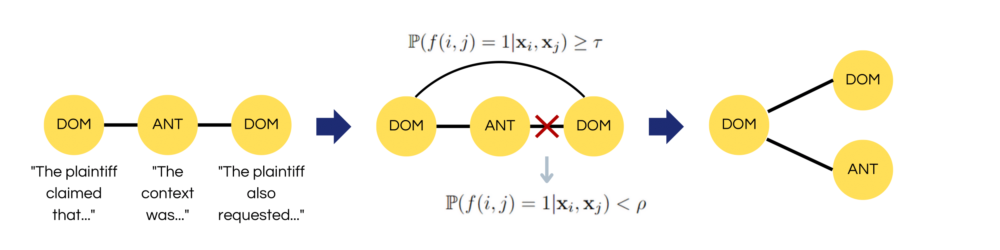

# TextSegmentation

This repository contains a PyTorch implementation of the methods described in the paper [Few-Shot Legal Text Segmentation via Rewiring Conditional Random Fields: a Preliminary Study](https://link.springer.com/chapter/10.1007/978-3-031-47112-4_13), to be presented at the [2nd International Workshop on Digital Justice, Digital Law, and Conceptual Modeling (JUSMOD 2023)](https://jusmod2023.github.io/).

If you use our code, please cite our paper:
```
@InProceedings{ferrarapicasciariva2023,
author="Ferrara, Alfio and Picascia, Sergio and Riva, Davide",
editor="Sales, Tiago Prince and Ara{\'u}jo, Jo{\~a}o and Borbinha, Jos{\'e} and Guizzardi, Giancarlo",
title="Few-Shot Legal Text Segmentation via Rewiring Conditional Random Fields: A Preliminary Study",
booktitle="Advances in Conceptual Modeling",
year="2023",
publisher="Springer Nature Switzerland",
address="Cham",
pages="141--150",
abstract="Functional Text Segmentation is the task of partitioning a textual document in segments that play a certain function. In the legal domain, this is important to support downstream tasks, but it faces also challenges of segment discontinuity, few-shot scenario, and domain specificity. We propose an approach that, revisiting the underlying graph structure of a Conditional Random Field and relying on a combination of neural embeddings and engineered features, is capable of addressing these challenges. Evaluation on a dataset of Italian case law decisions yields promising results.",
isbn="978-3-031-47112-4"
}
```

---

## In a nutshell

The proposed approach addresses the task of Text Segmentation in the few-shot scenario. It does so by learning how to re-wire the underlying graph structure of a linear-chain Conditional Random Field (CRF) model, adding connections between non-consecutive elements with probability 1 - `cutoff_prob_high` and pruning connections between consecutive elements with probability 1 - `cutoff_prob_low`.



Usage:

```
# Importing modules
from TextSegmentation.sentenceclassifiers import *
import torch

# Initialize parameters
learning_rate_P = 0.001
learning_rate_N = 0.001
training_epochs = 100
optimizer = torch.optim.AdamW
scheduler = torch.optim.lr_scheduler.OneCycleLR
embedding_size = 384
device = "cuda" if torch.cuda.is_available() else "cpu"
classes = ['A','B','C']
edge_cutoff_high = 0.9
edge_cutoff_low = 0.6


# Initialize a model
P_classifier = FFNN(input_size = embedding_size * 2,
                    hidden_sizes = (256,),
                    output_size = 1,
                    inner_activation = torch.nn.ReLU(),
                    final_activation = torch.nn.Sigmoid(),
                    loss_function = torch.nn.BCELoss(),
                    optimizer = optimizer,
                    lr_scheduler = scheduler,
                    optimizer_params = {"lr": learning_rate_P},
                    scheduler_params = {"max_lr": learning_rate_P * 10, "epochs": training_epochs, "steps_per_epoch": 1},
                    device = device)

N_classifier = GeneralCRF(input_size = embedding_size,
                          output_size = len(classes),
                          loss_function = torch.nn.CrossEntropyLoss(),
                          optimizer = optimizer,
                          optimizer_params = {"lr": learning_rate_N},
                          lr_scheduler = scheduler,
                          scheduler_params = {"max_lr": learning_rate_N * 10, "epochs": training_epochs, "steps_per_epoch": 1},
                          device = device,
                          bias = True)

model = PairGraphSeg(P_classifier,
                     N_classifier,
                     classes = classes,
                     cutoff_prob_high = edge_cutoff_high,
                     cutoff_prob_low = edge_cutoff_low,
                     rounding = True,
                     use_laplacian = False,
                     device = device)


# Training
# X_train = [...]
# y_train = [...]
model.fit(X_train, y_train, n_epochs = training_epochs)


# Testing
# X_test = [...]
predictions = model.predict(X_test)
```
